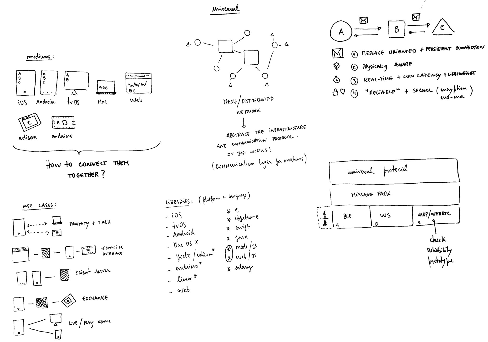

# Universal

Universal is the communication toolkit we use at coletiv.

We make projects for all kinds of devices and platforms such as:

- iOS
- Web
- Mac 
- Arduino
- Intel Edison / Linux Yocto
- Android
- Beaglebone
- Raspberry Pi
- tvOS

*"How to connect them together?"*

The universal project (*wip*) answers this question. The key points are:

1. Message oriented protocol with a persistent connection
2. Physically aware 
3. Real-time, low latency and lightweight 
4. Reliable and secure

The image below shows an overview of the project vision.

